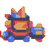
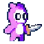
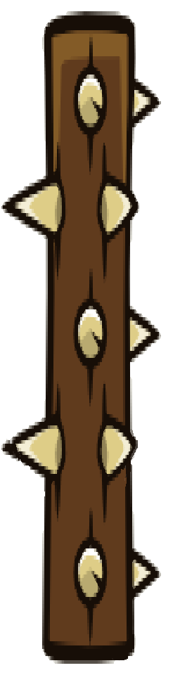
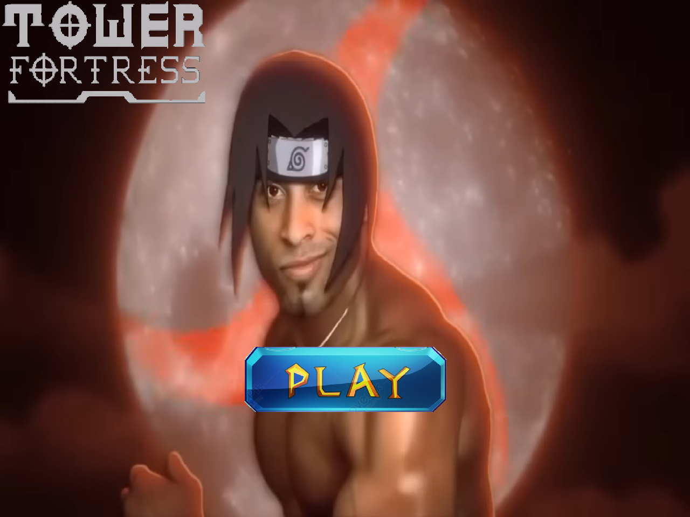
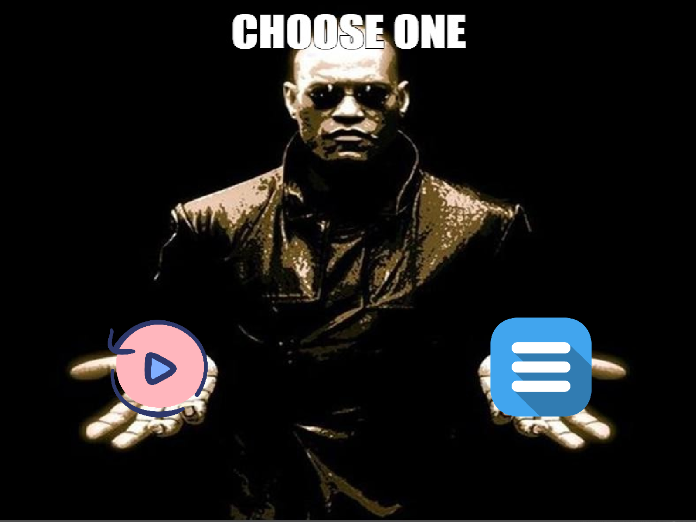

# TOWER FORTRESS
link video code: https://drive.google.com/file/d/1PMYi7Fz9CwDZ4cpX-M97AzwDw19ly5u_/view?usp=sharing
link video demo: https://drive.google.com/file/d/1tQIwCH1AG0_hgcFiNvbXJi-pPYWS9o2Q/view?usp=sharing
# Giới thiệu về game
Tower Fortress là dạng game nhập vai. Bạn bị mắc kẹt trong 1 mê cung và bạn cần phải thoát ra, trong mê cung sẽ có những con vật muốn giết bạn, 1 cái gai khổng lồ đuổi theo bạn, và những cái hố sẽ khiến bạn chết nếu rơi xuống. Việc của bạn là đi đến cuối mê cung để thoát ra ngoài.
# cách tải game 
cách 1: download file.zip theo đường link sau: https://github.com/nguyentienhiep24021468/Runendless 

cách 2: tải trực tiếp code về, tải các file ảnh và âm thanh về sau đó cài các sdl liên quan. 

# cách thành phần chính trong game:
  
<em>Ghi chú: Đây là player.</em>

 
<em>Ghi chú: Đây là con bot.</em>

 
<em>Ghi chú: Đây là gai lớn.</em>

 
<em>Ghi chú: Đây là item boost nhảy cao.</em>

 
<em>Ghi chú: Đây là item boost tốc chạy.</em>
 
 
<em>Ghi chú: Đây là item ăn vào chết luôn.</em>

-Khi bắt đầu game một menu sẽ hiện ra:
-

-có thể bấm chuột vào biểu tượng hình play để chơi
khi chết hoặc chiến thắng menu sau sẽ hiện ra:
-

-bấm vào replay để chơi lại ngay, menu thì sẽ về giao diện lúc đầu game;
-

# cơ chế hoạt động
-Khi mới run code màn hình menu sẽ hiện ra với nhạc nền;
-
-Bấm play để chơi
-
-Di chuyển bằng    a:sang trái    d:sang phải    space:nhảy     j:bắn      k:nhảy
-
-Sẽ có những con quái ở đó bạn cần bắn chết hoặc nhảy qua nó để đi tiếp, mỗi con quái sẽ random rơi ra 1 trong 3 item ở trên. Item speed và jump thì sẽ có tác dụng trong 5 giây còn Item die thì ăn vào chết ngay;
-
-Con bot sẽ biết bạn đang ở gần nếu bạn nằm trong tầm mà nó check được(độ cao chênh lệnh là 2 ô và khoảng cách chênh lệnh < 6 ô), nếu check được nó sẽ lập tức tăng tốc đến chỗ bạn và chém bạn;
-
-Về cái gai khổng lồ nó chỉ bắt đầu di chuyển sau khi bạn bấm vào game và thực hiện 1 hành động nào đó(để tránh bấm play bị lag xong bị gai cán chết ngay )
-
-Khi đuổi theo bạn nếu bạn chạy quá nhanh và gai sắp tuột ra khỏi màn hình thì gai sẽ tự tăng tốc để luôn ở trong màn hình(nếu để bạn đi xa quá thì sẽ không còn kịch tính), ngoài ra nếu nó sắp cán được bạn bạn có thể bắn vào nó nó sẽ đi chậm lại trong 3 giây
-
-Gai khi cán vào con bot cũng sẽ khiến con bot chết;
-
-Ngoài ra gai sẽ dừng lại trước 4 tiled ở cuối map và tiếp tục xoay ở đó;
-
-Player sẽ chết khi bị bot chém, chạm vào gai, rơi xuống đáy màn hình ( map sẽ có những chỗ không có chỗ đứng );
-
-Khi chết âm thanh gameover hiện lên và menu sẽ hiện lên cho bạn 2 lựa chọn 1 là về menu chính 2 là chơi lại ngay;
-
-Khi thắng âm thanh victory hiện lên và menu cũng sẽ lên cho bạn 2 lựa chọn tương tự, bạn sẽ thắng khi chạm vào cuối map bên phải;
-
-Hơn nữa trong suốt quá trình chơi game sẽ luôn có nhạc;
-

# Cải tiến so với game gốc:
-Bot sẽ biết player ở gần để đi tới
-
-Spike bị làm chậm nếu bị bắn trúng
-
-Bot rớt item
-

# Đồ họa:
-ảnh nhân vật và con bot và cái gai tìm trên mạng
-
-map thì tìm các phiến đá vuông 64*64 và tự vẽ bằng tiled sau đó edit bằng libspire
-
-âm thanh: mạng
-
-Tất cả các file đều free trên mạng và có trong file picture;
-

# Ý tưởng:
-fakemg (youtube)
-

# Nguồn tham khảo:
-Ý tưởng game: https://www.youtube.com/watch?v=ObEOK7HSq2E, tham khảo code: https://www.youtube.com/watch?v=KsG6dJlLBDw&list=PL2RPjWnJduNmXHRYwdtublIPdlqocBoLS
-
-Vì game là private nên không tìm được source công khai nên không có code sẵn;
-
